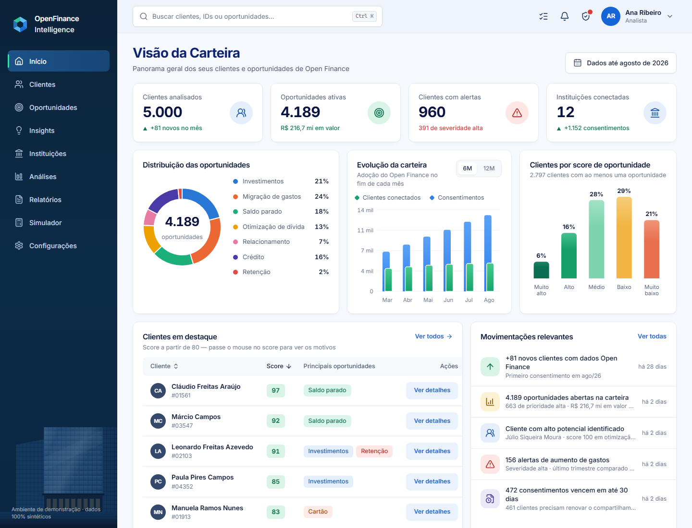
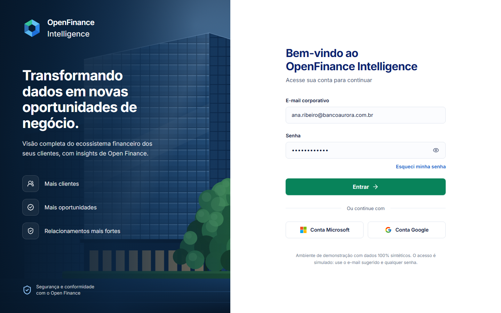
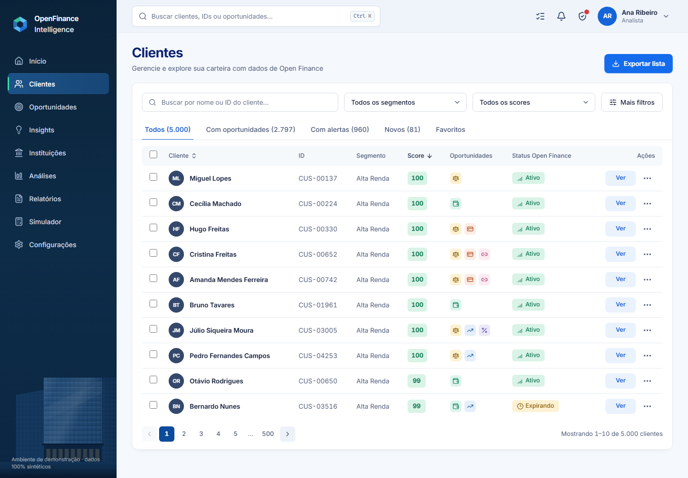
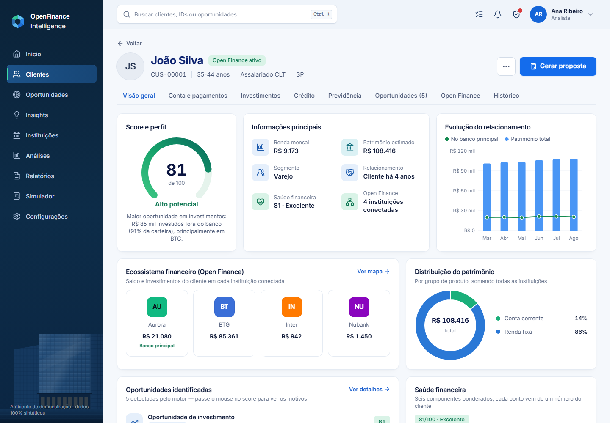
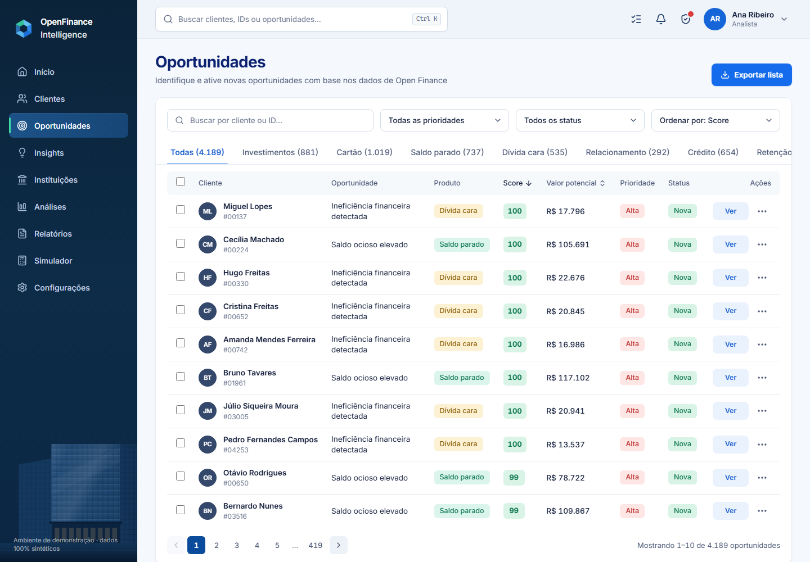
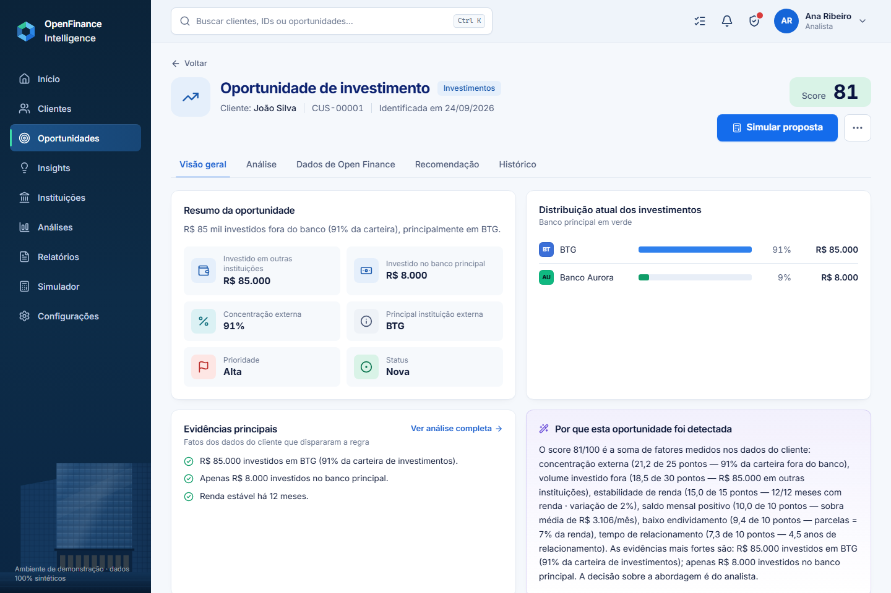
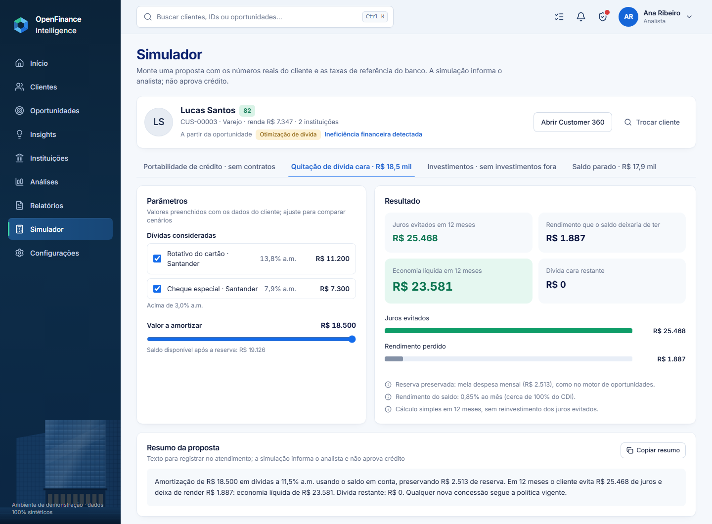
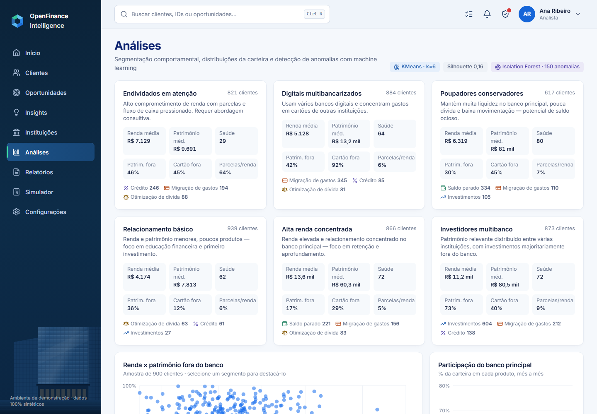
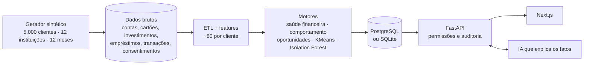

<div align="center">


# OpenFinance Intelligence

Plataforma para analistas de banco que junta os dados de Open Finance de cada cliente (contas, cartões, investimentos e empréstimos em várias instituições) e aponta oportunidades comerciais, sempre com a explicação de cada número.

FastAPI · PostgreSQL · pandas · scikit-learn · Next.js · React · TypeScript · Tailwind · Recharts · React Flow

</div>



> Projeto de portfólio. Todos os dados são sintéticos, gerados por um script do próprio projeto. O "Banco Aurora" é fictício, e os nomes das outras instituições aparecem só para ilustrar o ecossistema.

## Sobre o projeto

Com o Open Finance, o cliente pode autorizar que um banco veja os dados que ele tem em outros bancos. Na prática, isso mostra onde está o dinheiro dele, onde ele gasta e para quem ele deve. O problema é que esses dados chegam espalhados e crus.

A ideia foi montar a ferramenta que um time de inteligência comercial usaria no dia a dia. São 5 mil clientes na carteira e um motor que encontra oportunidades: saldo parado, investimento em outro banco, dívida cara, portabilidade de crédito, cliente prestes a sair. As telas servem para o analista entender cada caso antes de qualquer contato.

Duas regras guiaram tudo:

1. **Nenhum score aparece sem os motivos.** Ao passar o mouse em qualquer score você vê os fatores e as evidências que o formaram.
2. **A plataforma não decide nada sozinha.** Ela sugere e explica. Aprovar crédito, mudar limite ou ligar para o cliente continua sendo decisão do analista.

## Telas

| Login | Clientes |
|---|---|
|  |  |

| Customer 360 | Oportunidades |
|---|---|
|  |  |

| Detalhe da oportunidade | Simulador |
|---|---|
|  |  |

- **Início:** visão da carteira, distribuição das oportunidades, adoção do Open Finance mês a mês, clientes em destaque e movimentações.
- **Clientes:** busca, filtros (segmento, score, instituição, patrimônio, renda, endividamento...), abas, favoritos e exportação da lista.
- **Customer 360:** score e perfil, informações principais, evolução do relacionamento, ecossistema financeiro e distribuição do patrimônio. Tem abas por produto (contas, investimentos, crédito, previdência), o mapa do ecossistema em grafo, o histórico de comportamento e um resumo com IA.
- **Oportunidades:** lista por categoria, com prioridade, status e mudança de status em lote. O detalhe mostra as evidências, a composição do score, os dados de Open Finance, a ação recomendada e o histórico.
- **Simulador:** portabilidade de crédito, quitação de dívida cara, migração de investimentos e aplicação de saldo parado, com os números reais do cliente.
- **Insights, Instituições, Análises, Relatórios e Configurações:** insights automáticos da carteira, participação por instituição, segmentação com KMeans e anomalias, exportações em CSV, além das regras do motor, LGPD, auditoria e permissões.



## Como funciona por dentro



O processamento roda em lote, como um job diário rodaria depois da sincronização com o Open Finance:

1. Um gerador cria 5 mil clientes com 12 meses de histórico: contas, cartões, investimentos, empréstimos, cerca de 500 mil transações e os consentimentos.
2. O ETL consolida tudo em métricas mensais por cliente e num grafo cliente ↔ instituição.
3. Saem umas 80 features por cliente (estabilidade do saldo, participação de outros bancos, comprometimento da renda, variações do trimestre...).
4. Os motores rodam em cima dessas features: saúde financeira, mudanças de comportamento, as 7 regras de oportunidade, segmentação e anomalias.
5. O resultado vai para tabelas prontas para consulta. A API só lê o que já foi calculado, então as telas respondem rápido.

O gerador sabe quem é "investidor em outro banco" ou "cliente indo embora", mas os motores não têm acesso a isso. Eles precisam redescobrir esses perfis olhando só para saldos e transações, como aconteceria com dados reais.

### Motor de oportunidades

Cada regra soma fatores, e cada fator vale até um certo número de pontos. O score é essa soma, então dá para rastrear cada ponto até um número do cliente. Oportunidades abaixo de 45 são descartadas; de 80 para cima têm prioridade alta.

| Tipo | Quando dispara |
|---|---|
| Saldo parado | saldo alto e estável em conta, pouco movimentado |
| Investimentos | pelo menos R$ 20 mil e 60% da carteira em outras instituições |
| Otimização de dívida | dívida acima de 3% a.m. com saldo em conta que cobre boa parte dela |
| Crédito (portabilidade) | empréstimo em outro banco com taxa acima da referência do banco |
| Migração de gastos | 60% ou mais dos gastos com cartão fora do banco |
| Relacionamento | salário no banco, mas investimentos, cartão e crédito concentrados fora |
| Retenção | salário migrou, saldo caiu, investimentos saíram ou uso de concorrentes subiu |

Um exemplo do dataset é o cliente João Silva, com score 81 em investimentos: tem R$ 85 mil no BTG (91% da carteira) e só R$ 8 mil no banco, renda estável há 12 meses e parcelas que comprometem 7% da renda.

Os parâmetros de cada regra aparecem na tela de Configurações e estão explicados em [docs/motor-de-oportunidades.md](docs/motor-de-oportunidades.md).

### IA

A IA só explica o que os motores já calcularam. Ela recebe uma ficha de fatos sem nome, ID ou transações do cliente, e o prompt proíbe inventar números ou sugerir crédito. Sem chave de API, um redator baseado em templates escreve o texto a partir dos mesmos fatos, então tudo funciona offline. Com `ANTHROPIC_API_KEY` no `backend/.env`, os textos passam a ser gerados pelo Claude (o modelo fica em `AI_MODEL`).

### LGPD e controle de acesso

- Os dados de outras instituições só existem para clientes com consentimento ativo.
- A base não guarda CPF, endereço, telefone nem e-mail. Os clientes são identificados por um ID interno.
- Visualização de cliente, uso de IA, mudança de status, exportação e execução do motor ficam registrados na trilha de auditoria.
- São três perfis (analista, coordenador e auditor), verificados na API em cada requisição. Dá para trocar de perfil no menu do usuário, no canto superior direito, e ver o que cada um pode fazer.
- O login é simulado: no ambiente de demonstração qualquer senha entra. Em produção isso seria o SSO do banco.

## Rodando localmente

### Windows (o jeito mais fácil)

Dê dois cliques em `iniciar.bat`. Na primeira vez ele instala as dependências (precisa de Python 3.11+ e Node.js 20+). Depois sobe a API e o site e abre o navegador em http://localhost:3000. Para desligar, feche as janelas "OFI - API" e "OFI - Site".

### Pelo terminal

```bash
cd backend
python -m venv .venv
.venv\Scripts\activate          # Linux/macOS: source .venv/bin/activate
pip install -r requirements-dev.txt
uvicorn app.main:app --reload --port 8000
```

Em outro terminal:

```bash
cd frontend
npm install
npm run dev
```

Na primeira execução, a API gera os dados sintéticos, o que leva uns 40 segundos. Depois é só abrir http://localhost:3000 e entrar com o e-mail sugerido e qualquer senha.

Para gerar os dados de novo com outras opções, use `python -m app.pipeline.seed --customers 20000 --seed 7`. Com `--rerun`, só os motores são reexecutados.

### Com Docker

```bash
cp .env.example .env
docker compose up --build
```

O comando sobe o PostgreSQL, a API e o frontend. A documentação da API fica em http://localhost:8000/docs.

## Testes

```bash
cd backend && pytest && ruff check .
cd frontend && npm run lint && npm run typecheck && npm run build
```

São 37 testes no backend. Eles cobrem gerador, regras do motor, saúde financeira, API, permissões, auditoria e relatórios, e um deles garante que nenhum identificador do cliente vai para o LLM. O GitHub Actions roda os testes em SQLite e em PostgreSQL e faz lint, checagem de tipos e build do frontend.

As cores dos gráficos foram validadas para daltonismo e contraste, e nenhum gráfico usa dois eixos Y.

## Estrutura

```
backend/
  app/
    api/routes/     carteira, clientes, oportunidades, insights, instituições, análises, governança, relatórios
    core/           configuração, banco, permissões e auditoria, formatação pt-BR
    data/           gerador sintético e vocabulário do domínio
    models/         tabelas brutas, analíticas e de governança (SQLAlchemy)
    pipeline/       ETL, features, orquestração e o comando de seed
    services/       motor de oportunidades, saúde financeira, comportamento, IA, insights
    ml/             KMeans e Isolation Forest
  tests/
frontend/
  src/app/          páginas (login, início, clientes, customer 360, oportunidades, simulador...)
  src/components/   gráficos, layout, telas do cliente e componentes de interface
  src/lib/          cliente da API, tipos, formatação, cores e rótulos
docs/               arquitetura, motor de oportunidades, roteiro de demonstração e prints
iniciar.bat         abre tudo no Windows com dois cliques
```

## Próximos passos

- Modelos de propensão treinados com as conversões registradas no workflow.
- Previsão de saldo e fluxo de caixa por cliente.
- Busca por clientes parecidos (embeddings).
- Login real via SSO e visibilidade restrita à carteira de cada gerente.

Mais detalhes: [arquitetura e API](docs/arquitetura.md) · [motor de oportunidades](docs/motor-de-oportunidades.md) · [roteiro de demonstração](docs/roteiro-de-demonstracao.md)
