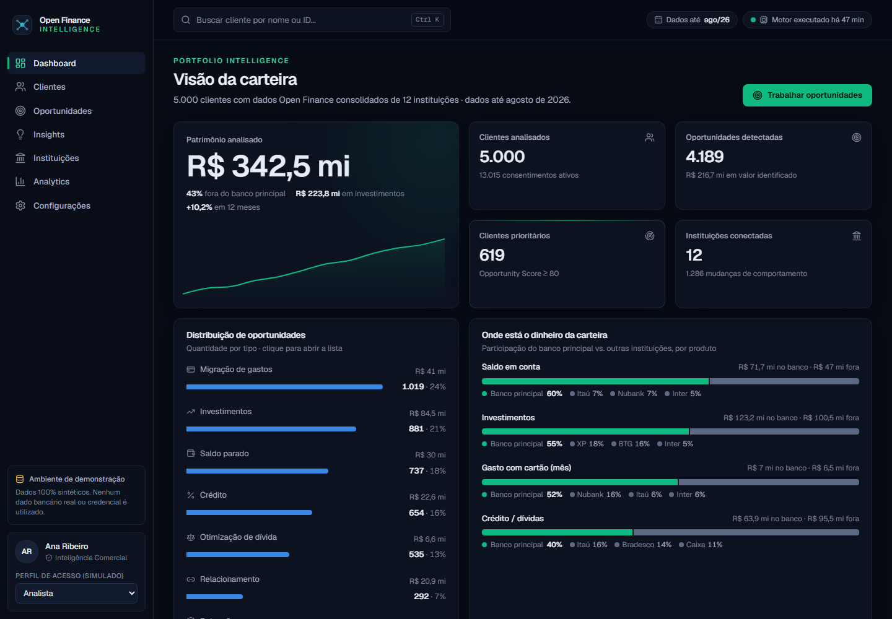
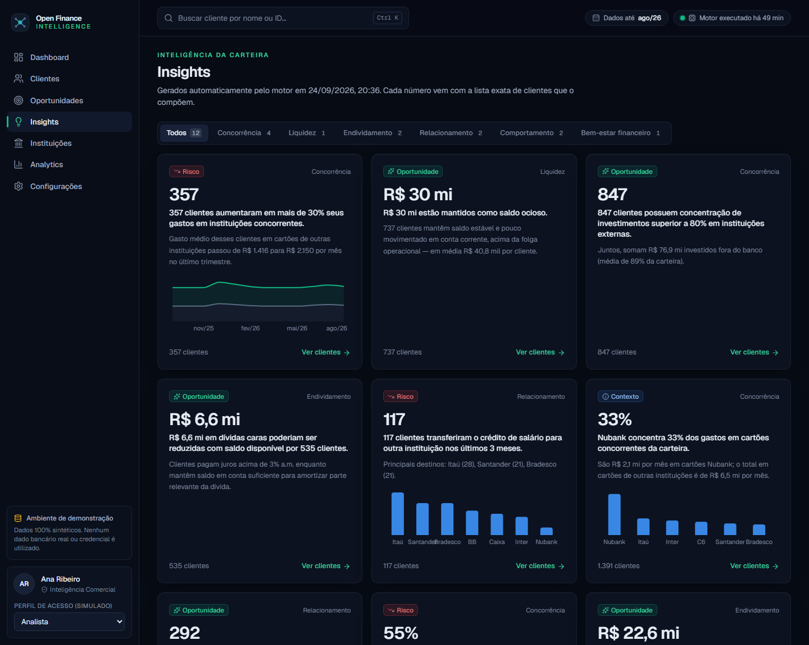
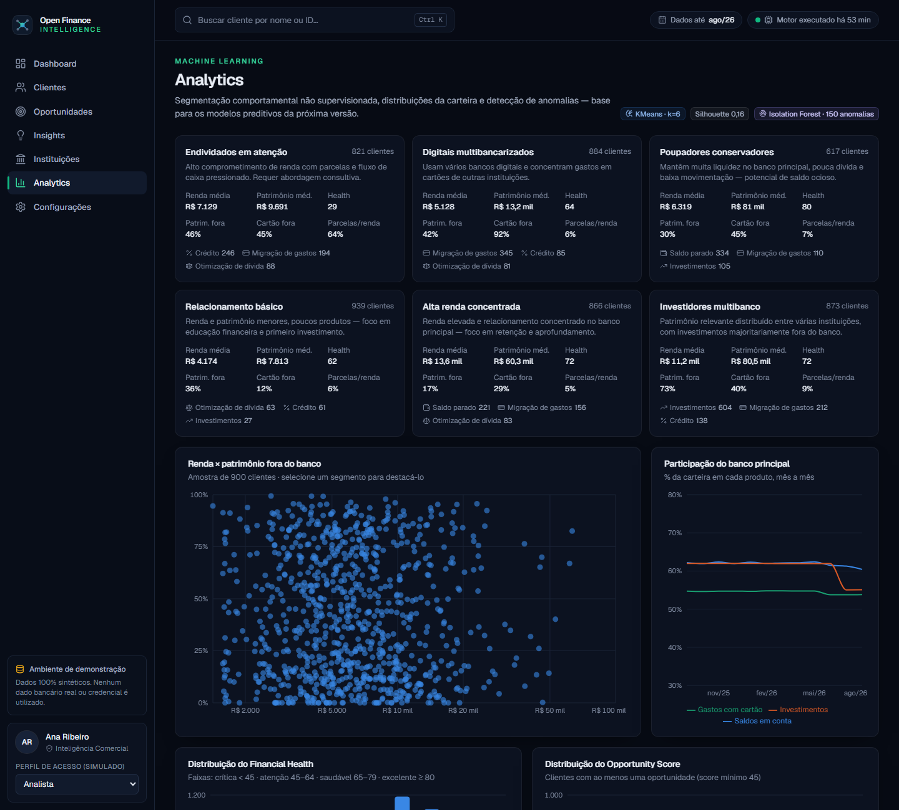
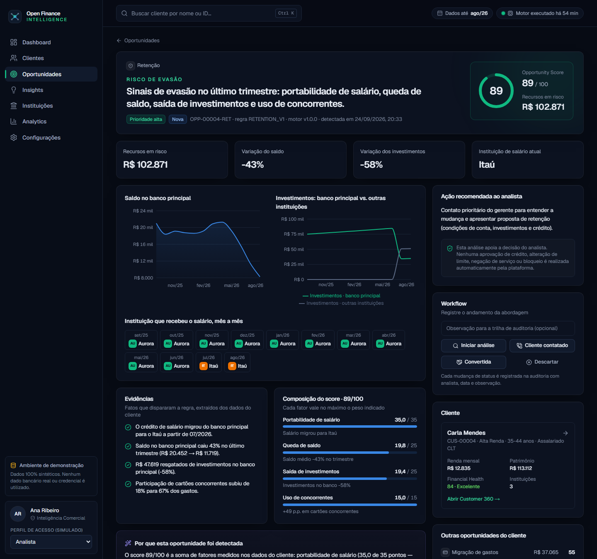
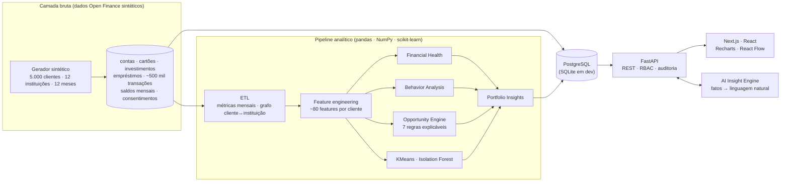

<div align="center">


# Open Finance Intelligence

**Plataforma de inteligência financeira que transforma dados fragmentados entre instituições em uma visão consolidada do cliente e identifica automaticamente oportunidades financeiras explicáveis.**

FastAPI · PostgreSQL · pandas · scikit-learn · Next.js 16 · React 19 · TypeScript · Tailwind CSS v4 · Recharts · React Flow · LLM (opcional)

</div>



> **Projeto de portfólio com dados 100% sintéticos.** Nenhum dado bancário real, credencial ou informação pessoal é utilizado. O banco principal ("Banco Aurora") é fictício; os nomes das demais instituições servem apenas para ilustrar o ecossistema Open Finance e não indicam qualquer relação com elas.

---

## Sumário

- [O problema](#o-problema)
- [O que a plataforma faz](#o-que-a-plataforma-faz)
- [Telas](#telas)
- [Arquitetura](#arquitetura)
- [Opportunity Engine](#opportunity-engine)
- [Financial Health, comportamento e Machine Learning](#financial-health-comportamento-e-machine-learning)
- [IA generativa com guardrails](#ia-generativa-com-guardrails)
- [Segurança, LGPD e ética](#segurança-lgpd-e-ética)
- [Como executar](#como-executar)
- [Testes e qualidade](#testes-e-qualidade)
- [Estrutura do repositório](#estrutura-do-repositório)
- [Roadmap](#roadmap)

## O problema

Com o Open Finance, o cliente pode autorizar o compartilhamento dos seus dados entre instituições. Para o banco, isso revela o que antes era invisível: **onde está o dinheiro do cliente, onde ele gasta, quanto deve e a quem**. Mas os dados chegam fragmentados — contas, cartões, investimentos, empréstimos e transações espalhados por vários bancos.

O Open Finance Intelligence é uma ferramenta interna para **analistas de inteligência comercial** que consolida essa visão para milhares de clientes e responde perguntas como:

- Quais clientes têm **dinheiro parado** em conta corrente?
- Quem mantém **investimentos relevantes em outras instituições**?
- Quem paga **juros altos** enquanto tem saldo disponível?
- Quem concentra **gastos em cartões concorrentes**?
- Quem está **reduzindo o relacionamento** com o banco (salário migrou, saldo caiu, investimentos saíram)?
- **Por que** determinada oportunidade foi criada?

O fluxo de uso é: **Carteira → Oportunidades → Clientes prioritários → Customer 360 → Análise financeira → Evidências → Insights**.

## O que a plataforma faz

| Área | Destaques |
|---|---|
| **Portfolio Intelligence** | Patrimônio analisado, oportunidades por tipo, participação do banco vs. concorrentes por produto, clientes prioritários (com os motivos do score no hover), mudanças relevantes e insights automáticos. |
| **Clientes** | Busca (inclusive sem acento) e 11 filtros sincronizados com a URL: score, tipo de oportunidade, instituição, patrimônio, renda, endividamento, nº de bancos, saúde financeira, segmento. |
| **Customer 360** | Header com Financial Health e Opportunity Score, **grafo do ecossistema financeiro** (React Flow) com drill-down por instituição, onde está o dinheiro, mapa de relacionamento, fluxo de caixa em cascata, oportunidades com evidências, saúde financeira explicada, mudanças de comportamento, timeline em *small multiples* e IA. |
| **Oportunidades** | 7 tipos, filtros por status/prioridade, detalhe com visualização específica por tipo, composição do score, evidências, ação recomendada e **workflow auditado** (em análise → contatado → convertida/descartada). |
| **Insights** | 12 insights da carteira gerados a cada execução do motor — cada número abre **exatamente** a lista de clientes que o compõe. |
| **Instituições** | Share of wallet por instituição, produtos, evolução mensal e sobreposição com clientes que recebem salário no banco. |
| **Analytics** | Segmentação KMeans nomeada automaticamente, scatter com ênfase por segmento, distribuições, tendência de participação e anomalias (Isolation Forest). |
| **Configurações** | Regras e parâmetros do motor, execução sob demanda, consentimentos, princípios LGPD, trilha de auditoria, matriz de permissões e guardrails de IA. |

## Telas

| Customer 360 | Detalhe de oportunidade |
|---|---|
|  |  |

| Clientes | Insights |
|---|---|
|  |  |

| Analytics | Risco de evasão |
|---|---|
|  |  |

## Arquitetura



- **Camada bruta → curada → features → motores**: o pipeline roda em lote (como um job diário faria após a sincronização Open Finance) e grava tabelas analíticas prontas para consulta. A API só lê resultados — respostas em dezenas de milissegundos.
- **Os motores não conhecem a "verdade" do gerador**: os comportamentos latentes (poupador, investidor externo, risco de evasão…) ficam no gerador; as regras precisam **redescobri-los** a partir das transações e saldos, como fariam com dados reais.
- **IDs estáveis de oportunidade** (`OPP-00001-INV`): reexecutar o motor preserva o status que os analistas já deram.
- **PostgreSQL em produção, SQLite como fallback** para rodar sem Docker. Cargas grandes usam `COPY` no PostgreSQL.

Detalhes do modelo de dados, endpoints e decisões de projeto: [`docs/arquitetura.md`](docs/arquitetura.md).

## Opportunity Engine

Motor **baseado em regras explicáveis**: cada regra soma *fatores* (cada um vale no máximo X pontos e é pontuado de 0 a 1 a partir de uma métrica observada). O score é a soma dos pontos — **todo ponto é rastreável até um número** — e nenhuma oportunidade é gravada sem evidências.

| Tipo | Dispara quando… | Principais fatores |
|---|---|---|
| **Saldo parado** | saldo de fim de mês ≥ R$ 15 mil, estável em 5 de 6 meses, pouco movimentado e sem dívida cara | valor ocioso, estabilidade, baixo giro, renda recorrente, baixo endividamento |
| **Investimentos** | ≥ R$ 20 mil investidos fora e ≥ 60% da carteira em outras instituições | volume externo, concentração, estabilidade de renda, dívida, tempo de relacionamento, sobra mensal |
| **Otimização de dívida** | dívida > 3% a.m. com saldo disponível cobrindo ≥ 50% dela | custo dos juros, cobertura, diferença de taxa, economia em 12 meses |
| **Crédito (portabilidade)** | empréstimo em concorrente com taxa acima da referência do banco | spread relativo, saldo portável, economia para o cliente, comprometimento de renda |
| **Migração de gastos** | ≥ 60% dos gastos com cartão fora do banco | participação externa, volume, tendência, vínculo com o banco |
| **Relacionamento** | salário no banco, mas 2+ categorias (investimentos, cartão, crédito) majoritariamente fora | produtos fora, patrimônio externo, renda, tempo de relacionamento |
| **Retenção** | combinação de portabilidade de salário, queda de saldo, saída de investimentos e aumento de uso de concorrentes | um fator por sinal |

Prioridade: **alta ≥ 80**, média ≥ 60; oportunidades abaixo de 45 não são exibidas. Exemplo real do dataset (persona *João Silva*):

> **Investimentos · 81/100** — R$ 85.000 investidos em BTG (91% da carteira); apenas R$ 8.000 no banco principal; renda estável há 12 meses; parcelas = 7% da renda; 4 anos de relacionamento; sobra média de R$ 3.106/mês.

Detalhes, parâmetros e metodologia: [`docs/motor-de-oportunidades.md`](docs/motor-de-oportunidades.md).

## Financial Health, comportamento e Machine Learning

- **Financial Health Score (0–100)** — seis componentes ponderados, cada um com a métrica e o texto que o explicam: fluxo de caixa (20%), endividamento (20%), liquidez (15%), poupança (15%), investimentos (15%) e estabilidade de renda (15%).
- **Detecção de mudanças de comportamento** — último trimestre vs. trimestre anterior: portabilidade de salário, saída de investimentos, queda de saldo, aumento de uso de cartão concorrente, aumento de gastos, queda de renda e aumento de dívida — sempre com os valores de antes e depois.
- **Segmentação (KMeans, k=6)** — sobre renda, patrimônio, participação externa, comprometimento de renda, liquidez e saúde financeira; os clusters recebem nomes de negócio por **atribuição húngara** entre centroides e arquétipos (ex.: *Investidores multibanco*, *Poupadores conservadores*, *Endividados em atenção*).
- **Anomalias (Isolation Forest)** — variações trimestrais atípicas, com os dois fatores que mais pesaram.
- **Insights automáticos** — frases como *"357 clientes aumentaram em mais de 30% seus gastos em instituições concorrentes"* ou *"R$ 30 mi estão mantidos como saldo ocioso"*, cada uma ligada à lista exata de clientes.

## IA generativa com guardrails

A IA **não descobre nada — ela explica**. O *AI Insight Engine* monta uma **ficha de fatos** com os resultados dos motores (scores, evidências, sinais, posições por instituição) e só isso é enviado ao modelo:

- **sem nome, ID ou transações** do cliente (minimização LGPD);
- prompt de sistema proíbe inventar números, instituições ou intenções e qualquer recomendação de crédito;
- **sem chave de API, um redator determinístico** produz o texto a partir dos mesmos fatos — a plataforma funciona 100% offline;
- toda resposta informa a **fonte** (LLM ou template) e os **fatos utilizados**; cada uso é auditado.

Recursos: *AI Financial Summary* e *Ask Intelligence* ("Por que esse cliente recebeu score 81?", "Onde estão os recursos do cliente?"). Com `ANTHROPIC_API_KEY` configurada, os textos são gerados pelo modelo definido em `AI_MODEL` (padrão `claude-opus-5`), com *fallback* automático do lado do servidor caso uma solicitação seja recusada.

## Segurança, LGPD e ética

| Princípio | Como está implementado |
|---|---|
| Consentimento | Dados de outras instituições só existem com consentimento Open Finance ativo; consentimentos revogados deixam de alimentar a análise. |
| Finalidade | Uso restrito à finalidade consentida, registrada em cada acesso. |
| Minimização | Sem CPF, endereço, telefone ou e-mail; faixa etária em vez de data de nascimento; IDs internos. |
| Rastreabilidade | Auditoria de visualização de cliente, uso de IA, mudança de status e execução do motor. |
| Controle de acesso | Perfis **analista**, **coordenador** e **auditor**, verificados na API em cada requisição (troque o perfil na barra lateral para ver o efeito). |
| Decisões humanas | A plataforma **não aprova, nega, limita ou bloqueia nada automaticamente** — fornece evidências para a decisão do analista. |

## Como executar

### Com Docker (PostgreSQL + API + web)

```bash
cp .env.example .env        # opcional: defina ANTHROPIC_API_KEY
docker compose up --build
```

Na primeira inicialização a API gera o dataset sintético e executa todos os motores (≈1 min). Depois acesse:

- Aplicação: http://localhost:3000
- API (Swagger): http://localhost:8000/docs

### Local, sem Docker (SQLite)

Requisitos: Python 3.11+ e Node.js 20.9+.

```bash
# Backend
cd backend
python -m venv .venv
.venv/Scripts/activate          # Windows  (Linux/macOS: source .venv/bin/activate)
pip install -r requirements-dev.txt
python -m app.pipeline.seed     # gera 5.000 clientes e executa os motores
uvicorn app.main:app --reload --port 8000
```

```bash
# Frontend (outro terminal)
cd frontend
npm install
npm run dev                     # http://localhost:3000 (proxy /api → :8000)
```

Opções do seed: `--customers 20000` (carteira maior), `--seed 7` (outro dataset reproduzível), `--reference-date 2026-09-24` e `--rerun` (reexecuta só os motores sobre os dados brutos já gravados).

## Testes e qualidade

```bash
cd backend && pytest && ruff check .
cd frontend && npm run lint && npm run typecheck && npm run build
```

- **28 testes** cobrindo gerador (reprodutibilidade, integridade referencial, sinais das transações), regras do motor (disparo, não disparo, score = soma dos fatores, evidências obrigatórias), saúde financeira, API, RBAC, auditoria e a garantia de que **nenhum identificador vai para o LLM**.
- **CI no GitHub Actions** roda os testes do backend contra **SQLite e PostgreSQL** e lint, typecheck e build do frontend.
- Paleta de gráficos validada para daltonismo e contraste na superfície escura; nenhum gráfico usa eixo Y duplo (medidas de escalas diferentes viram *small multiples*).

## Estrutura do repositório

```
backend/
  app/
    api/routes/        portfolio, customers, opportunities, insights, institutions, analytics, governance
    core/              configuração, banco, segurança (RBAC + auditoria), formatação pt-BR
    data/              gerador sintético e vocabulário de domínio
    models/            SQLAlchemy — camada bruta, analítica e de governança
    pipeline/          ETL, features, orquestração e CLI de seed
    services/          opportunity_engine/, financial_health, behavior_analysis, ai_insights, portfolio_insights
    ml/                segmentação (KMeans) e anomalias (Isolation Forest)
  tests/
frontend/
  src/app/             páginas (dashboard, clientes, customer 360, oportunidades, insights, instituições, analytics, configurações)
  src/components/      charts, customer, opportunity, dashboard, layout, ui
  src/lib/             cliente da API, tipos, formatação, rótulos
docs/                  arquitetura, motor de oportunidades, roteiro de demonstração, screenshots
docker-compose.yml
```

## Roadmap

- **Modelos de propensão** (qual produto ofertar) treinados sobre o histórico de conversões registrado no workflow.
- **Forecasting** de saldo e fluxo de caixa por cliente (séries temporais).
- **Embeddings de clientes** para busca por similaridade ("clientes parecidos com este").
- Monitoramento de *drift* das features e das taxas de disparo das regras.
- Autenticação real via SSO/OIDC e *row-level security* por carteira de gerente.

## Documentação

- [Arquitetura, modelo de dados e API](docs/arquitetura.md)
- [Opportunity Engine, Financial Health e ML](docs/motor-de-oportunidades.md)
- [Roteiro de demonstração](docs/roteiro-de-demonstracao.md)
