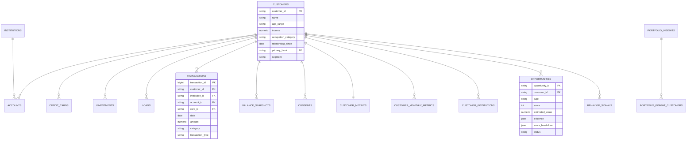

# Arquitetura

## Visão geral

```
FRONTEND (Next.js)  →  /api (proxy do Next)  →  FASTAPI  →  SERVICES  →  BANCO (PostgreSQL | SQLite)
                                                              ↑
                         PIPELINE EM LOTE: gerador → ETL → features → motores → insights
                                                              ↓
                                                     AI INSIGHT ENGINE
```

O sistema separa **processamento em lote** (pipeline analítico) de **leitura** (API). Os motores rodam sobre a carteira inteira e gravam tabelas analíticas; a API apenas consulta e monta as telas. É o mesmo desenho de um banco real, em que os dados Open Finance chegam por sincronização periódica e os modelos rodam em janelas batch.

## Pipeline de dados

| Etapa | Módulo | O que faz |
|---|---|---|
| Geração | `app/data/generator.py` | Cria perfis (demografia, comportamentos latentes, plano de produtos) e os materializa em registros Open Finance: contas, cartões, investimentos, empréstimos, 12 meses de transações e saldos de fim de mês por instituição, além de consentimentos. Determinístico por `seed`. |
| ETL | `app/pipeline/etl.py` | Transações → fluxo mensal (renda, gastos, parcelas, aplicações, gastos por cartão do banco vs. concorrentes, instituição que recebeu o salário). Saldos → posições mensais. Monta o grafo cliente↔instituição com produtos e valores. |
| Features | `app/pipeline/features.py` | ~80 features por cliente em janelas de 3, 6 e 12 meses (estabilidade de saldo, giro, participação externa, comprometimento de renda, dívida cara, variações trimestrais…). |
| Motores | `app/services/*`, `app/ml/*` | Financial Health, sinais de comportamento, Opportunity Engine, KMeans e Isolation Forest. |
| Insights | `app/services/portfolio_insights.py` | Frases da carteira + a lista exata de clientes de cada uma. |
| Persistência | `app/pipeline/runner.py` | Substitui as tabelas analíticas numa transação; preserva o status das oportunidades já trabalhadas; registra a execução e a auditoria. `COPY` no PostgreSQL para tabelas grandes. |

Tempo típico para 5.000 clientes (~500 mil transações): geração ~12 s, carga ~15 s (SQLite), motores ~3–8 s.

`python -m app.pipeline.seed --rerun` (ou o botão **Executar motor agora** em Configurações, perfil Coordenador) reexecuta apenas ETL + motores sobre os dados brutos gravados.

## Modelo de dados



**Camada bruta** (campos do enunciado): `customers`, `accounts`, `transactions`, `credit_cards`, `investments`, `loans`, `institutions`, `balance_snapshots`, `consents`.

**Camada analítica**: `customer_monthly_metrics` (cliente × mês), `customer_institutions` (arestas do grafo), `customer_metrics` (perfil desnormalizado com scores, usado nas listas e filtros), `behavior_signals`, `opportunities`, `segments`, `portfolio_insights` + `portfolio_insight_customers`.

**Governança**: `audit_logs`, `engine_runs`.

Valores monetários são `NUMERIC(14,2)`; taxas de juros são `% a.m.`; colunas JSON viram `JSONB` no PostgreSQL.

## API

Documentação interativa em `http://localhost:8000/docs`.

| Método | Rota | Descrição |
|---|---|---|
| GET | `/api/meta` | Vocabulário, instituições, segmentos, analista e permissões |
| GET | `/api/portfolio/summary` | KPIs da carteira e tendência mensal |
| GET | `/api/portfolio/opportunity-distribution` | Oportunidades por tipo |
| GET | `/api/portfolio/priority-customers` | Clientes prioritários (score ≥ 80), com motivos |
| GET | `/api/portfolio/wallet-share` | Banco principal vs. outras instituições por produto |
| GET | `/api/portfolio/recent-signals` | Mudanças de comportamento mais relevantes |
| GET | `/api/portfolio/activity` | Movimentações relevantes da tela inicial (conexões, oportunidades, alertas, consentimentos) |
| GET | `/api/customers` | Lista paginada com filtros (inclui abas: com oportunidades, com alertas, novos, favoritos) |
| GET | `/api/customers/tab-counts` | Quantos clientes cada aba da lista mostraria, com os outros filtros aplicados |
| GET | `/api/customers/search` | Busca rápida (Ctrl+K) |
| GET | `/api/customers/{id}` | Customer 360 completo |
| GET | `/api/customers/{id}/institutions/{inst}` | Drill-down por instituição |
| GET | `/api/customers/{id}/summary` | Resumo por IA (ou template) |
| POST | `/api/customers/{id}/ask` | Ask Intelligence |
| GET | `/api/opportunities` · `/summary` · `/{id}` | Lista, resumo e detalhe |
| PATCH | `/api/opportunities/{id}` | Workflow do analista (auditado) |
| GET | `/api/insights` | Insights da carteira |
| GET | `/api/institutions` · `/{id}` | Visão por instituição |
| GET | `/api/analytics/overview` | Segmentos, distribuições, scatter, anomalias |
| GET | `/api/governance/engine` · `/consents` · `/access` · `/audit-logs` | Governança |
| POST | `/api/engine/run` | Reexecuta os motores (Coordenador) |
| GET | `/api/reports` · `/api/reports/{relatório}` | Lista de relatórios e exportação em CSV (permissão verificada e registro na auditoria) |
| GET | `/api/reports/clientes` | Lista de clientes em CSV com os mesmos filtros da tela |

O perfil é simulado pelo cabeçalho `X-Analyst-Role` (`analista`, `coordenador`, `auditor`); em produção viria do SSO do banco. O login da interface também é simulado: um cookie de sessão liberado por qualquer senha, conferido pelo `proxy.ts` do Next.js antes de cada página.

## Decisões de projeto

- **Resultados pré-calculados.** Scores e evidências são calculados no pipeline e servidos prontos: telas rápidas e resultados reproduzíveis entre analistas.
- **Explicabilidade por construção.** O score é literalmente a soma dos fatores gravados em `score_breakdown`; as evidências são geradas pela mesma regra que calculou o score.
- **Ficha de fatos para a IA.** O LLM recebe apenas saídas dos motores, pré-formatadas em pt-BR, para que copie valores em vez de calculá-los.
- **Frontend como cliente da API.** Páginas client-side com TanStack Query (cache, `keepPreviousData` nos filtros), filtros e abas sincronizados com a URL e proxy `/api` pelo Next.js; o navegador nunca fala direto com o backend.
- **Visualização com método.** Interface clara com menu lateral azul-marinho. A paleta categórica dos gráficos foi validada para daltonismo e contraste sobre o branco, o banco principal aparece em verde contra as outras instituições em cinza, não há eixo Y duplo e os valores ficam legíveis sem depender de tooltip.
- **Simulador com as mesmas premissas do motor.** Taxas de referência, rendimento do CDI e rendimentos dos produtos vêm de `/api/meta`, então uma simulação nunca contradiz a oportunidade que a originou.
